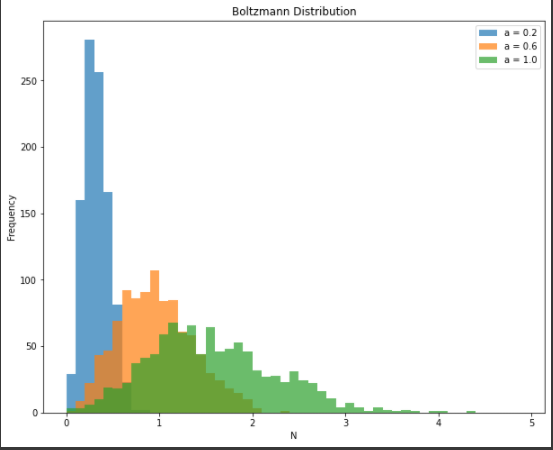
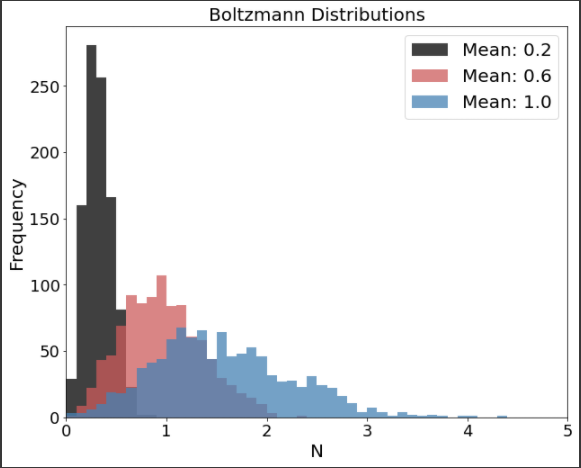

## Improvements:
1. Increase Font Size of All Labels and Tick Markers
      - before the text in the tick markers, titles, and legend were small and difficult to read   
2. Changed the Data Colors
      - before the light blue and green could be hard to distinguish because they do not have significant contrast. This can be even more difficult for those with color blindness.
      - the new contrasting colors are much easier to distinguish even for those who are color blind
3. Increased the Legend Size
      - before the legend was difficult to read and disproportionately small relative to the rest of the plot. Increasing its size makes it easier to read and more aesthetically pleasing
